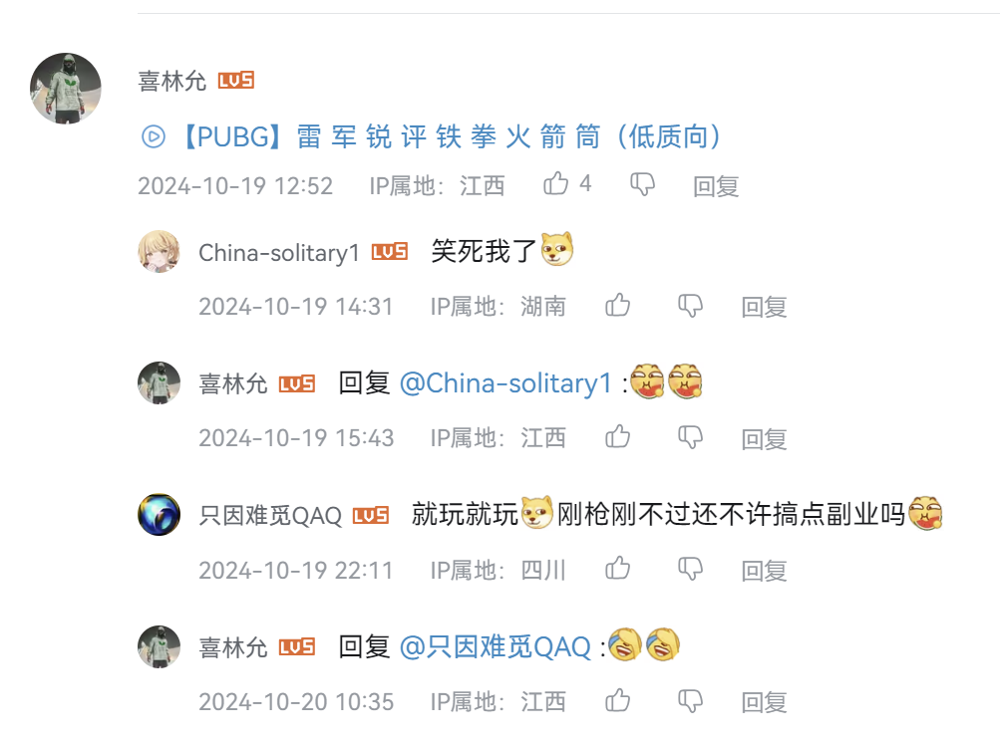
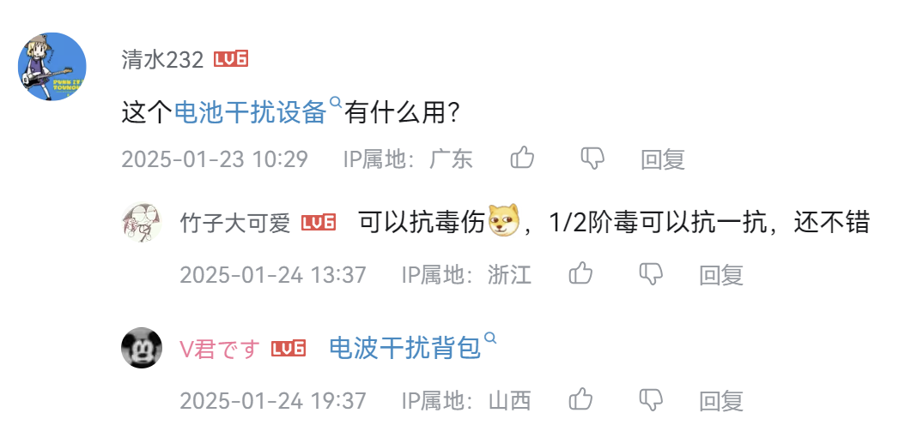

# BiliComment+ 📝

> B站评论系统优化工具 | Comment System Enhancement for Bilibili

---

## 🚀 核心功能

### 💬 评论系统优化
- 修复评论中@用户名显示错误问题
- 自动更新被@用户的最新昵称
- 优化评论请求处理
- 删除无用的PC跳转链接数据

---

## ⌨️ 功能对照表
| 功能描述            | 状态                    |
|--------------------|-------------------------|
| @用户名修复         | ✅ 已实现               |
| 去除评论跳转链接    | ✅ 已实现               |

---

## 📥 安装指南

1. **必备环境**  
   需先安装 [油猴插件][tm]（Tampermonkey）

2. **一键安装脚本**  
   [点击安装][install]

---

## 📸 效果展示

### @用户名显示修复
| 修复前 | 修复后 |
|--------|--------|
| | |

> 左图：原始评论中@用户名显示错误  
> 右图：使用脚本后显示正确的用户名
### 评论跳转显示修复
| 修复前 | 修复后 |
|--------|--------|
| | |

> 左图：原始评论中蓝色跳转
> 右图：使用脚本后显示纯净评论

---

## 🔄 更新日志

### v0.1
- 初始版本发布
- 实现基础评论优化功能
- 实现评论@昵称修复功能
  
### v0.2
- 修复了动态评论中@用户名显示错误的问题
- 修复了动态评论中评论跳转显示错误的问题

### v0.3
- 修复了番剧评论中@用户名显示错误的问题
- 修复了番剧评论中评论跳转显示错误的问题
---

## 💡 问题反馈
欢迎提交问题至 [Issues区][issues]

---

<!-- 隐式链接定义 -->
[tm]: https://www.tampermonkey.net/
[install]: https://github.com/uncharity/BiliComment-/raw/main/main.user.js
[issues]: https://github.com/uncharity/BiliComment-/issues